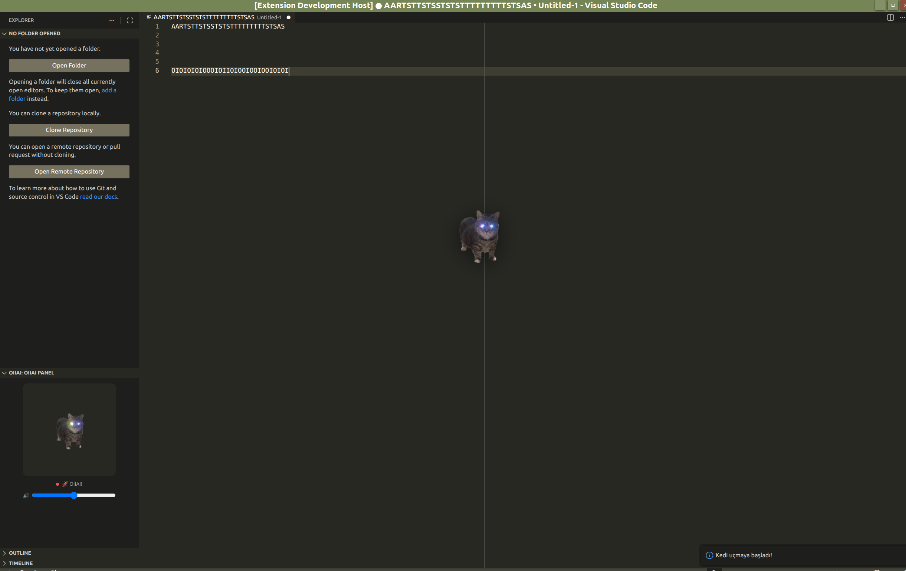

# OIIAI Code Extension

## Purpose
OIIAI Code brings a playful “cat companion” experience to VS Code. The Activity Bar panel shows the cat’s current state (idle/typing/dvd), with animations and audio that react to your coding. You can also toggle a flying cat decoration over the editor and open any image in a draggable floating panel.

## Features
- OIIAI panel: cat state (idle/typing/dvd) + animation + audio controls
- Automatic state transitions while typing (idle → typing → dvd)
- Flying cat editor decoration (toggle)
- Open a selected image in a draggable floating panel

## Installation
- Install from the VS Code Marketplace: https://marketplace.visualstudio.com/items?itemName=murmurlab.oiiai-code
- Dev setup: `npm install` → `npm run compile` → press F5 in VS Code.

## Build VSIX
- Install vsce (once): `npm i -g @vscode/vsce`
- Package: `npm run compile` → `vsce package`

## Usage
- Open the **OIIAI** panel from the Activity Bar.
- Run these commands from the Command Palette:
   - **OIIAI: Open Floating Image** — select an image to show in a draggable floating panel.
   - **OIIAI: Toggle Flying Cat 🐱** — toggle the flying cat decoration over the editor.

## Contributing
Contributions are welcome! Please open an issue or submit a pull request.

## License
This project is licensed under the MIT License.

